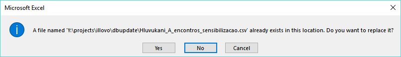

# Update Sensitisation Meetings

OPEN Excel File **Hluvukani\_A\_encontros\_sensibilizacao.xlsx** FROM **Y:\projects\illovo\dbupdate**

Enable Content and Refresh All, via the data tab

On the macro tab, run the macro **hluvukani\_A\_encontros\_prep** from "This Workbook"

The following message will appear:

Answer YES

Close Hluvukani\_A\_encontros\_sensibilizacao.xlsx

Open pgADMIN

Attach to the database tree of hluvukani

Open query tools, open file **hluvukani\_update\_form\_a\_encontros\_sensibilizacao**

Execute the query

This updates TABLE “public.form\_a\_encontros\_sensibilizacao” in the database

